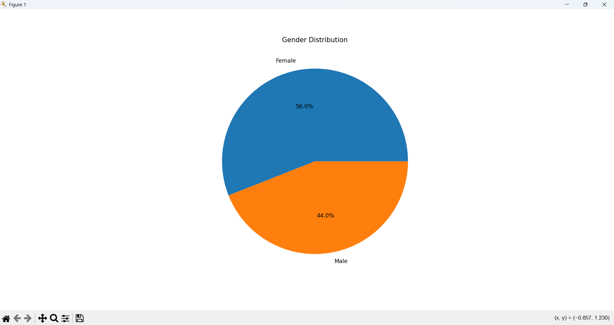
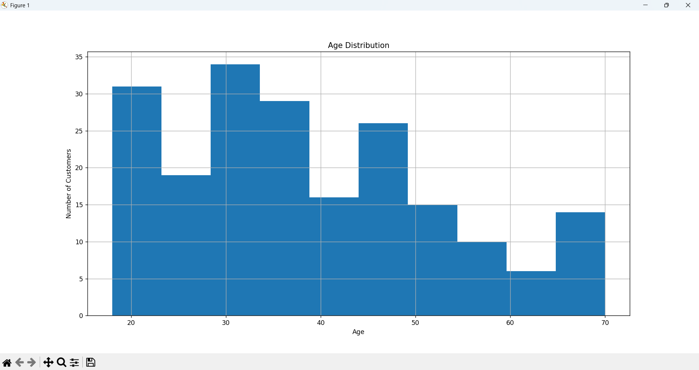
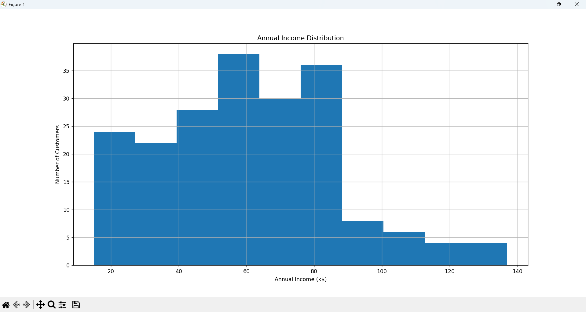
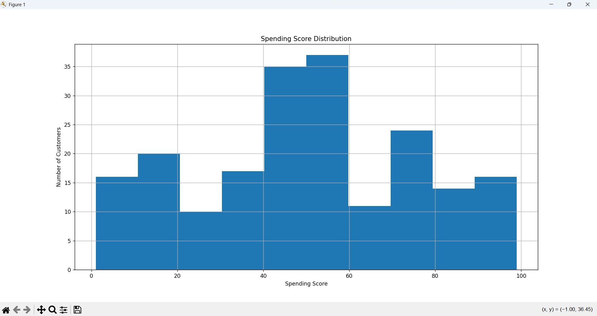
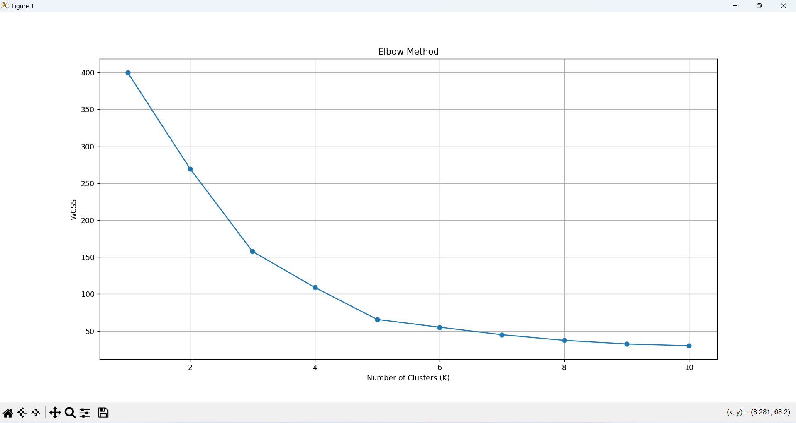
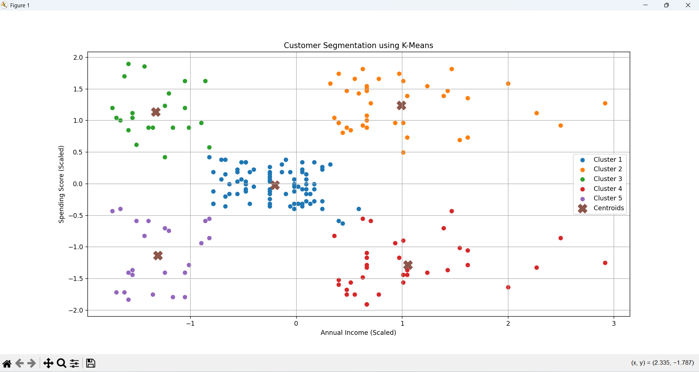

# Customer Segmentation Analysis 

## Project Overview
Customer Segmentation is the process of dividing customers into different groups based on their purchasing behavior and income patterns. This project uses the K-Means Clustering algorithm to identify customer segments from the Mall Customers dataset. These segments help businesses understand customer behavior and create targeted marketing strategies.

## Objectives
- Analyze customer data.
- Perform Exploratory Data Analysis (EDA).
- Apply data preprocessing and feature scaling.
- Determine the optimal number of clusters using the Elbow Method.
- Build a Customer Segmentation model using K-Means Clustering.
- Visualize customer groups.
- Save the trained model and segmented dataset.

## Dataset
**Dataset Name:** Mall_Customers.csv

### Dataset Features
- CustomerID
- Gender
- Age
- Annual Income (k$)
- Spending Score (1-100)

## Technologies Used
- Python
- VS Code

## Python Libraries
- Pandas
- Matplotlib
- Seaborn
- Scikit-learn
- Joblib

## Exploratory Data Analysis (EDA)
The following analyses were performed:
- Dataset Information
- Missing Value Check
- Duplicate Value Check
- Descriptive Statistics
- Gender Distribution
- Age Distribution
- Annual Income Distribution
- Spending Score Distribution

## Machine Learning Model
### Algorithm Used
**K-Means Clustering**

### Steps Performed
- Feature Selection
- Feature Scaling using StandardScaler
- Elbow Method
- Model Training
- Customer Segmentation
- Cluster Visualization

## Visualizations
The project includes the following graphs:
### Gender Distribution

### Age Distribution

### Annual Income Distribution

### Spending Score Distribution

### Elbow Method

### Customer Segmentation Scatter Plot


## How to Run

1. Download the project.
2. Install the required libraries.

```bash
pip install -r requirements.txt
```

3. Open the project in VS Code.

4. Run the Python file.

```bash
python customer_segmentation.py
```

## Results

- Successfully analyzed customer data.
- Determined the optimal number of clusters using the Elbow Method.
- Segmented customers into different groups using K-Means Clustering.
- Generated visualizations for better understanding.
- Saved the trained model as **customer_segmentation_model.pkl**.
- Exported the segmented customer data as **Customer_Segmentation_Result.csv**.

## Future Improvements

- Use more customer features for segmentation.
- Compare K-Means with DBSCAN and Hierarchical Clustering.
- Build an interactive dashboard using Power BI or Streamlit.
- Deploy the project as a web application.

##  Author

**Sadhna Kumari**
