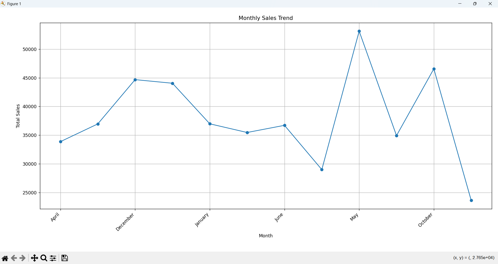
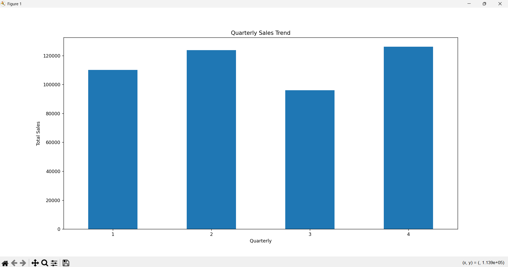
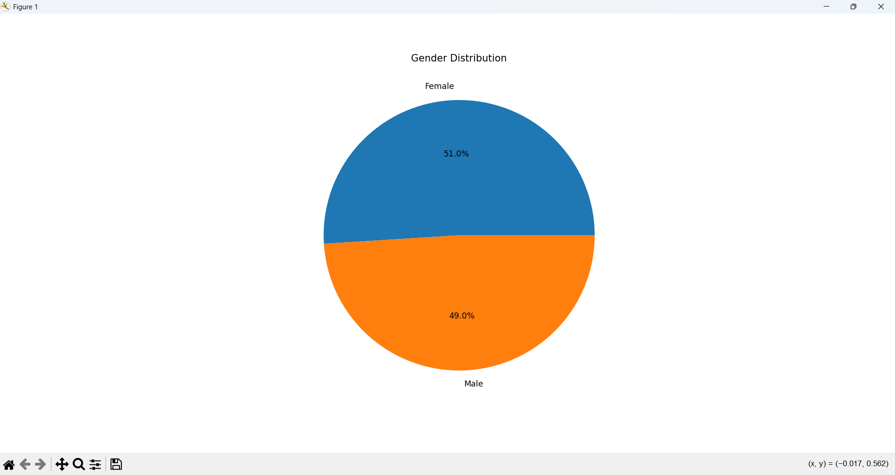
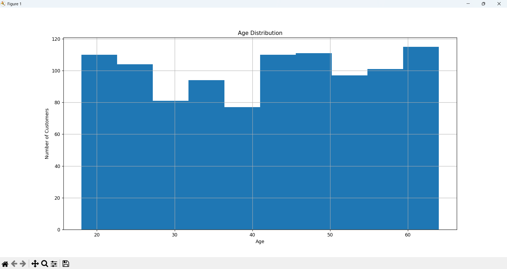
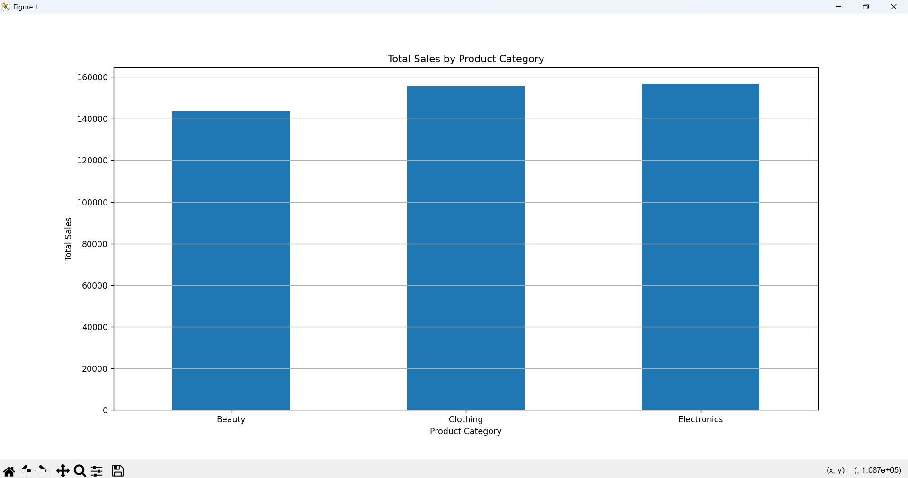
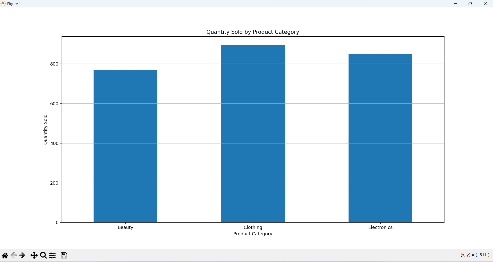
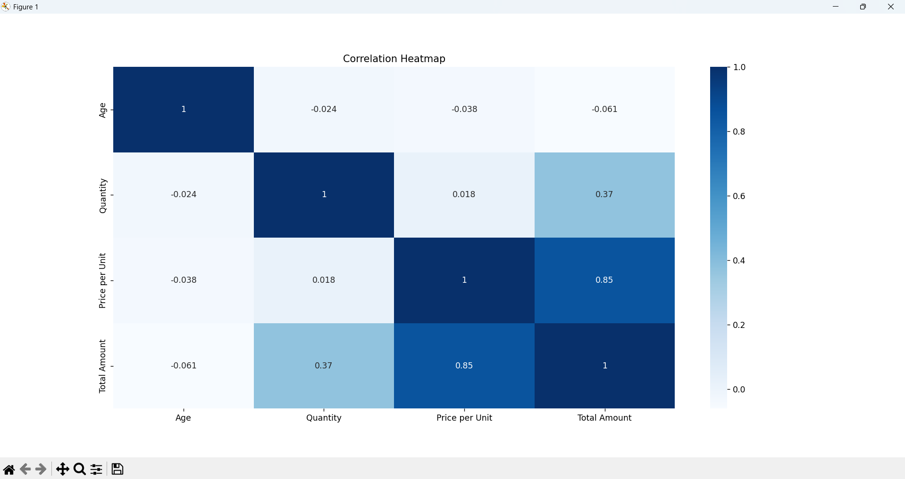
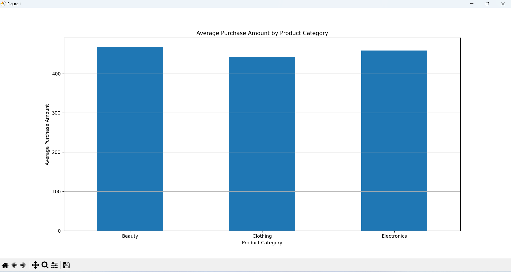

# Retail Sales Data Analysis

## Project Description

This project focuses on **Exploratory Data Analysis (EDA)** of a Retail Sales dataset using Python. The primary goal is to understand customer purchasing behavior, identify sales trends, analyze product performance, and generate meaningful business insights through data visualization and statistical analysis.

The project demonstrates how Python can be used to transform raw retail transaction data into actionable insights that support better business decisions.

# Objectives

- Explore and understand the retail sales dataset.
- Perform data cleaning and preprocessing.
- Analyze monthly and quarterly sales trends.
- Study customer demographics.
- Compare product category performance.
- Identify relationships between numerical variables.
- Generate business recommendations based on the analysis.

# Technologies Used

- Python
- Pandas
- Matplotlib
- Seaborn

# Dataset

The dataset contains retail transaction records with the following information:

- Transaction ID
- Date
- Customer ID
- Gender
- Age
- Product Category
- Quantity
- Price per Unit
- Total Amount

# Exploratory Data Analysis

The following analyses were performed:

- ✔ Data Inspection
- ✔ Missing Value Analysis
- ✔ Duplicate Record Check
- ✔ Descriptive Statistics
- ✔ Monthly Sales Trend
- ✔ Quarterly Sales Trend
- ✔ Gender Distribution
- ✔ Age Distribution
- ✔ Total Sales by Product Category
- ✔ Quantity Sold by Product Category
- ✔ Correlation Heatmap
- ✔ Average Purchase Amount by Product Category

# Project Visualizations

## Monthly Sales Trend


## Quarterly Sales Trend


## Gender Distribution


## Age Distribution


## Total Sales by Product Category


## Quantity Sold by Product Category


## Correlation Heatmap


## Average Purchase Amount by Product Category


# Key Findings

- Sales varied across different months and quarters.
- Product categories contributed differently to total revenue.
- Customer purchases were distributed across different age groups.
- Male and female customers showed balanced participation.
- Price per Unit had a strong positive correlation with Total Amount.

# Business Recommendations

- Focus marketing efforts on high-performing product categories.
- Maintain inventory during peak sales periods.
- Offer targeted promotional campaigns.
- Use customer purchasing patterns to improve business strategies.

# How to Run
```bash
pip install -r requirements.txt
```
3. Run the project:

```bash
python retail_sales_analysis.py
```

# Conclusion

This project successfully analyzed retail sales data using Exploratory Data Analysis techniques. The analysis revealed customer purchasing behavior, sales trends, and product performance through meaningful visualizations. These insights can help businesses make informed decisions regarding marketing strategies, inventory management, and overall sales performance.